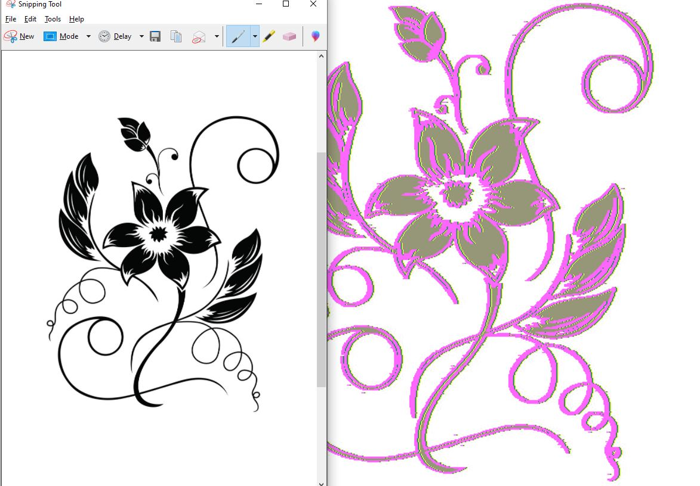

# app_to_change_images_colors
this app use python and image processing to change black and white images to other color also it give some helpful about the images and learn about it and get the position where the shape start and end that it used in idea to change the color images, not only and add shaodow and colored layers for border and control width of the layers (this app can edit any white and black image), also rotate the image detact the shape width of the image where it start and end and the shape height 

!note this app also can simple modfied to change any speacfic color in image to another color, for example replace any green color in uploaded image to yellow, etc (or color range but color range using rgb) and it handled full colored image

# example before and after:
note this image has 3 layers border (yellow, green, and pink)

